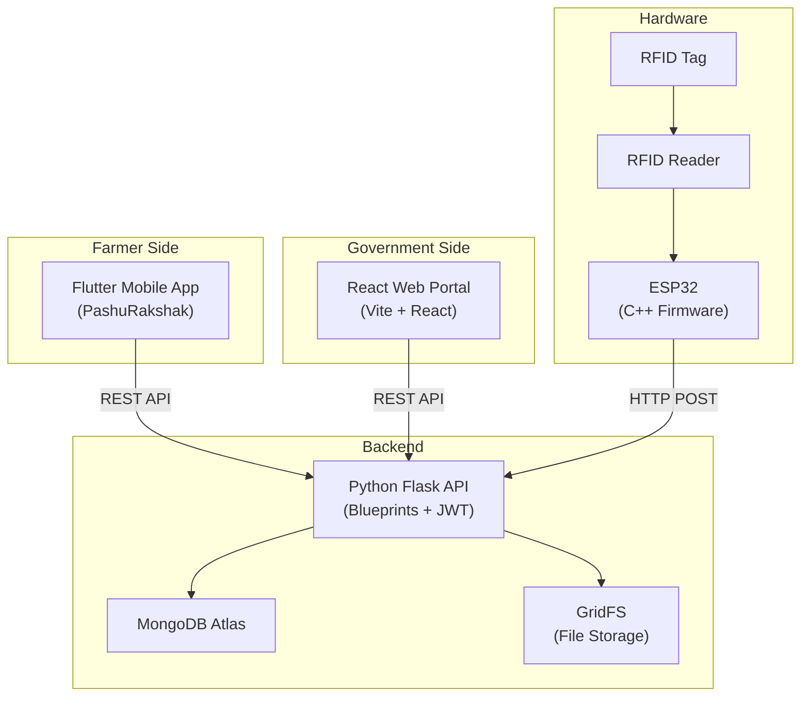

# PashuRakshak — Smart Livestock Verification & Government Grant Monitoring System

Complete implementation plan for a 3-tier IoT-based system to digitally verify cattle, prevent grant fraud, and create a farmer-government ecosystem.

---

## User Review Required

> [!IMPORTANT]
> **MongoDB Atlas Credentials Needed**: Please provide your MongoDB Atlas connection URL and database name before execution begins. The plan assumes these will be set in a `.env` file.

> [!IMPORTANT]
> **Flutter SDK**: Confirm that Flutter SDK is installed and available on your PATH. The plan will use `flutter create` to scaffold the app.

> [!WARNING]
> **Project Size**: This is a very large project (~150+ files). Execution will be broken into phases. The plan proposes building **Backend → Government Portal → Flutter App → Hardware** in sequence, with each phase independently testable.

---

## Open Questions

1. **MongoDB Details**: What is your MongoDB Atlas connection URL and database name?
2. **Flutter SDK Version**: Which Flutter SDK version do you have installed? (Run `flutter --version`)
3. **Node.js Version**: Which Node.js version is installed? (Run `node --version`)
4. **3 Languages**: The plan uses **English, Hindi, Marathi** for the farmer app. Should any language be different?
5. **Government Login**: Should government officers log in with username+password or mobile+OTP? (Plan assumes username+password for simplicity since no Twilio/SMS service.)
6. **Farmer Login**: Same question — mobile+password? (Plan assumes mobile+password.)

---

## Architecture Overview



---

## Proposed Changes

### Phase 1: Backend (Python Flask)

#### Project Structure

```
backend/
├── app/
│   ├── __init__.py              # create_app() factory
│   ├── config.py                # Configuration from .env
│   ├── extensions.py            # PyMongo, JWT, GridFS init
│   ├── seed.py                  # Seed data (3 schemes, 3 farmers)
│   ├── models/
│   │   ├── __init__.py
│   │   ├── farmer.py            # Farmer document helpers
│   │   ├── scheme.py            # Scheme document helpers
│   │   ├── officer.py           # Officer document helpers
│   │   ├── rfid.py              # RFID allocation helpers
│   │   ├── raid.py              # Raid/meeting helpers
│   │   └── notification.py      # Notification helpers
│   ├── routes/
│   │   ├── __init__.py
│   │   ├── auth.py              # Login/register (farmer + govt)
│   │   ├── farmers.py           # Farmer CRUD + profile
│   │   ├── schemes.py           # Scheme CRUD + listing
│   │   ├── applications.py      # Scheme applications (multi-step)
│   │   ├── verification.py      # Approve/reject applications
│   │   ├── rfid.py              # Tag allocation + boundary
│   │   ├── raids.py             # Raid scheduling + results
│   │   ├── scanning.py          # RFID scan session + validation
│   │   ├── reports.py           # PDF generation + download
│   │   ├── files.py             # File upload/download (GridFS)
│   │   ├── notifications.py     # Notification endpoints
│   │   ├── analytics.py         # Dashboard stats + charts
│   │   └── audit.py             # Audit log endpoints
│   ├── services/
│   │   ├── __init__.py
│   │   ├── pdf_service.py       # ReportLab PDF generation
│   │   ├── image_service.py     # Pillow compression
│   │   └── validation_service.py # RFID validation logic
│   ├── middleware/
│   │   ├── __init__.py
│   │   └── auth_guard.py        # Role-based access decorators
│   └── utils/
│       ├── __init__.py
│       ├── helpers.py           # Common utility functions
│       └── constants.py         # Status codes, roles, etc.
├── hardware/
│   ├── esp32/
│   │   └── rfid_scanner.cpp     # ESP32 C++ firmware
│   ├── rfid/
│   │   └── README.md            # RFID hardware setup guide
│   └── api/
│       └── README.md            # Hardware API documentation
├── requirements.txt
├── run.py                       # Entry point
├── .env.example                 # Environment template
└── .env                         # Actual secrets (gitignored)
```

---

#### Database Schema (MongoDB Collections)

| Collection | Purpose | Key Fields |
|---|---|---|
| `users` | All users (farmers + officers + admins) | `_id`, `name`, `mobile`, `password_hash`, `role`, `language`, `created_at` |
| `farmers` | Extended farmer profiles | `_id`, `user_id`, `dob`, `age`, `state`, `district`, `acres`, `farmer_proof_file_id`, `status` |
| `schemes` | Government schemes | `_id`, `name`, `motive`, `eligibility`, `sponsor`, `benefits`, `description`, `images`, `required_validations`, `required_cattle_count`, `duration`, `status`, `created_at` |
| `applications` | Farmer scheme applications | `_id`, `farmer_id`, `scheme_id`, `step1_data`, `step2_data`, `step3_data`, `documents`, `status`, `rejection_reason`, `created_at` |
| `rfid_allocations` | Tag boundary per farmer per scheme | `_id`, `farmer_id`, `scheme_id`, `application_id`, `tag_ids[]`, `allocated_at` |
| `raids` | Scheduled officer raids | `_id`, `farmer_id`, `scheme_id`, `officer_id`, `application_id`, `date`, `time`, `status`, `created_at` |
| `scan_sessions` | RFID scanning sessions | `_id`, `raid_id`, `officer_id`, `farmer_id`, `status`, `started_at`, `ended_at`, `scanned_tags[]` |
| `scan_logs` | Individual tag scan results | `_id`, `session_id`, `tag_id`, `status` (matched/unmatched/suspicious), `scanned_at` |
| `validations` | Per-meeting validation results | `_id`, `application_id`, `raid_id`, `session_id`, `matched_count`, `total_allocated`, `result` (pass/fail), `created_at` |
| `notifications` | User notifications | `_id`, `user_id`, `title`, `body`, `type`, `read`, `created_at` |
| `audit_logs` | System audit trail | `_id`, `user_id`, `action`, `details`, `ip_address`, `timestamp` |
| `fs.files` / `fs.chunks` | GridFS file storage | Managed by GridFS |

---

#### Hardcoded Seed Data

**3 Schemes:**

| # | Scheme Name | Required Cattle | Validations |
|---|---|---|---|
| 1 | Rashtriya Gokul Mission | 50+ cows | 3 validations |
| 2 | National Dairy Plan Phase-II | 100+ cows | 5 validations |
| 3 | Gaushala Development Grant | 200+ cows | 4 validations |

**3 Farmer Profiles:**

| # | Name | Mobile | District | State | Cattle Count |
|---|---|---|---|---|---|
| 1 | Ramesh Patil | 9876543210 | Pune | Maharashtra | 75 |
| 2 | Suresh Kumar | 9876543211 | Jaipur | Rajasthan | 120 |
| 3 | Ganesh Sharma | 9876543212 | Indore | Madhya Pradesh | 250 |

**Default password for all seed users:** `pashurakshak123`

**3 Government Officers:**

| # | Name | Username | Role |
|---|---|---|---|
| 1 | Officer Amit Verma | admin | admin |
| 2 | Officer Priya Singh | officer1 | officer |
| 3 | Officer Rahul Deshmukh | officer2 | officer |

---

#### Key API Endpoints

| Method | Endpoint | Description |
|---|---|---|
| **Auth** | | |
| POST | `/api/auth/register` | Farmer registration |
| POST | `/api/auth/login` | Login (farmer/officer) |
| GET | `/api/auth/profile` | Get current user profile |
| **Schemes** | | |
| GET | `/api/schemes` | List all active schemes |
| GET | `/api/schemes/:id` | Get scheme details |
| POST | `/api/schemes` | Create scheme (govt only) |
| PUT | `/api/schemes/:id` | Update scheme (govt only) |
| DELETE | `/api/schemes/:id` | Delete scheme (govt only) |
| **Applications** | | |
| POST | `/api/applications` | Submit scheme application |
| GET | `/api/applications` | List applications (filtered) |
| GET | `/api/applications/:id` | Get application details |
| PUT | `/api/applications/:id` | Update application (resubmit) |
| **Verification** | | |
| POST | `/api/verification/:id/approve` | Approve application |
| POST | `/api/verification/:id/reject` | Reject application |
| **RFID** | | |
| POST | `/api/rfid/allocate` | Allocate tags to farmer |
| GET | `/api/rfid/allocation/:farmer_id` | Get tag boundary |
| **Raids** | | |
| POST | `/api/raids` | Schedule raid |
| GET | `/api/raids` | List raids |
| **Scanning** | | |
| POST | `/api/scanning/session/start` | Start scan session |
| POST | `/api/scanning/tag` | Submit scanned tag (ESP32 calls this) |
| POST | `/api/scanning/session/end` | End scan session + compute result |
| GET | `/api/scanning/session/:id/results` | Get scan results |
| **Files** | | |
| POST | `/api/files/upload` | Upload file to GridFS |
| GET | `/api/files/:id` | Download/serve file |
| **Reports** | | |
| GET | `/api/reports/validation/:app_id` | Generate validation PDF |
| **Analytics** | | |
| GET | `/api/analytics/dashboard` | Dashboard statistics |
| GET | `/api/analytics/cattle-attendance` | Cattle attendance graph data |
| GET | `/api/analytics/scheme-stats` | Scheme-wise statistics |
| **Notifications** | | |
| GET | `/api/notifications` | Get user notifications |
| PUT | `/api/notifications/:id/read` | Mark as read |

---

### Phase 2: Government Portal (React + Vite)

#### Project Structure

```
government-portal/
├── public/
│   └── assets/
├── src/
│   ├── main.jsx
│   ├── App.jsx
│   ├── index.css                 # Design system + CSS variables
│   ├── api/
│   │   ├── client.js             # Fetch wrapper with JWT
│   │   ├── auth.js
│   │   ├── farmers.js
│   │   ├── schemes.js
│   │   ├── raids.js
│   │   ├── scanning.js
│   │   ├── analytics.js
│   │   └── files.js
│   ├── components/
│   │   ├── common/
│   │   │   ├── Button.jsx
│   │   │   ├── Card.jsx
│   │   │   ├── Modal.jsx
│   │   │   ├── Table.jsx
│   │   │   ├── Badge.jsx
│   │   │   ├── SearchFilter.jsx
│   │   │   └── FilePreview.jsx
│   │   ├── layout/
│   │   │   ├── Sidebar.jsx
│   │   │   ├── Header.jsx
│   │   │   └── DashboardLayout.jsx
│   │   ├── charts/
│   │   │   ├── CattleAttendanceChart.jsx
│   │   │   ├── SchemeStatsChart.jsx
│   │   │   └── ValidationPieChart.jsx
│   │   └── forms/
│   │       ├── SchemeForm.jsx
│   │       ├── RaidScheduleForm.jsx
│   │       └── TagAllocationForm.jsx
│   ├── pages/
│   │   ├── Login.jsx
│   │   ├── Dashboard.jsx
│   │   ├── Schemes/
│   │   │   ├── SchemesList.jsx
│   │   │   └── CreateScheme.jsx
│   │   ├── Farmers/
│   │   │   ├── FarmersList.jsx
│   │   │   └── FarmerDetails.jsx
│   │   ├── Verification/
│   │   │   └── VerificationPanel.jsx
│   │   ├── Raids/
│   │   │   ├── RaidsList.jsx
│   │   │   └── ScanningDashboard.jsx
│   │   ├── Analytics/
│   │   │   └── AnalyticsDashboard.jsx
│   │   ├── AuditLogs.jsx
│   │   ├── Settings.jsx
│   │   ├── Support.jsx
│   │   └── Profile.jsx
│   ├── context/
│   │   ├── AuthContext.jsx
│   │   └── ThemeContext.jsx
│   ├── hooks/
│   │   └── useApi.js
│   └── utils/
│       └── helpers.js
├── package.json
└── vite.config.js
```

#### UI Design — Government Theme

**Color Palette:**
- Primary: Navy Blue `#000080` (authority, trust)
- Secondary: Saffron `#FF9933` (Indian tricolor accent)
- Success: Green `#138808` (Indian tricolor)
- Background: Cool grey `#F5F7FA` (light) / `#0F1117` (dark)
- Cards: White `#FFFFFF` / `#1A1D2E` (dark)

**Design Elements:**
- Sidebar navigation with icons + text labels
- Card-based dashboard with stat counters
- Data tables with search, filter, pagination
- Status badges (Approved = green, Rejected = red, Pending = saffron)
- Clean typography using **Inter** font from Google Fonts
- Subtle box shadows and smooth hover transitions
- Gradient header (navy → saffron gradient accent line)
- Dark mode toggle in header
- Official government-feel aesthetic (formal, clean, no playful elements)

**Key Pages:**
1. **Login** — Clean centered form with government seal/emblem area
2. **Dashboard** — Stats cards (total farmers, schemes, pending applications, active raids) + charts
3. **Schemes Management** — CRUD table + create form with image upload
4. **Farmer Applications** — Card-based list with document/image/video viewer, approve/reject with dropdown reasons
5. **Tag Allocation** — Form to allocate RFID IDs after approval
6. **Raid Scheduling** — Form + calendar view
7. **Scanning Dashboard** — Real-time scan results table (green tick / red cross), session controls
8. **Analytics** — Recharts bar/line/pie charts for cattle attendance, scheme stats, validation trends
9. **Audit Logs** — Searchable/filterable log table
10. **Settings** — Profile management, dark mode, preferences

---

### Phase 3: Flutter Mobile App (PashuRakshak)

#### Project Structure

```
pashuRakshak/
├── lib/
│   ├── main.dart
│   ├── app.dart
│   ├── l10n/
│   │   ├── app_en.arb            # English
│   │   ├── app_hi.arb            # Hindi
│   │   └── app_mr.arb            # Marathi
│   ├── core/
│   │   ├── constants/
│   │   │   ├── app_colors.dart
│   │   │   ├── api_endpoints.dart
│   │   │   └── app_constants.dart
│   │   ├── theme/
│   │   │   └── app_theme.dart
│   │   └── widgets/
│   │       ├── custom_button.dart
│   │       ├── custom_text_field.dart
│   │       ├── status_badge.dart
│   │       ├── loading_overlay.dart
│   │       └── file_upload_card.dart
│   ├── services/
│   │   ├── api_service.dart      # Dio HTTP client
│   │   ├── auth_service.dart
│   │   ├── storage_service.dart
│   │   └── notification_service.dart
│   ├── models/
│   │   ├── user_model.dart
│   │   ├── farmer_model.dart
│   │   ├── scheme_model.dart
│   │   ├── application_model.dart
│   │   └── notification_model.dart
│   ├── providers/
│   │   ├── auth_provider.dart
│   │   ├── scheme_provider.dart
│   │   ├── application_provider.dart
│   │   ├── language_provider.dart
│   │   └── theme_provider.dart
│   └── features/
│       ├── auth/
│       │   └── screens/
│       │       ├── language_selection_screen.dart
│       │       ├── login_screen.dart
│       │       └── register_screen.dart
│       ├── home/
│       │   └── screens/
│       │       └── home_screen.dart
│       ├── schemes/
│       │   └── screens/
│       │       ├── schemes_list_screen.dart
│       │       ├── scheme_detail_screen.dart
│       │       └── scheme_registration/
│       │           ├── step1_basic_details.dart
│       │           ├── step2_documents.dart
│       │           └── step3_cattle_proof.dart
│       ├── applications/
│       │   └── screens/
│       │       ├── my_applications_screen.dart
│       │       └── application_detail_screen.dart
│       ├── notifications/
│       │   └── screens/
│       │       └── notifications_screen.dart
│       ├── profile/
│       │   └── screens/
│       │       └── profile_screen.dart
│       └── settings/
│           └── screens/
│               └── settings_screen.dart
├── assets/
│   ├── images/
│   └── icons/
├── l10n.yaml
└── pubspec.yaml
```

#### UI Design — Farmer App Theme

**Color Scheme:** Same Indian government palette (saffron/navy/green) adapted for mobile.

**Key Screens:**
1. **Language Selection** — 3 large buttons (English / हिंदी / मराठी) — shown before login
2. **Login** — Mobile + Password + government-styled header
3. **Registration** — Multi-field form with farmer details
4. **Home** — Scheme cards + status summary + notification bell
5. **Scheme List** — Card-based with images, "Know More" button
6. **Scheme Detail** — Full details + eligibility + "Register" CTA
7. **Registration Form (3-step)** — Stepper UI with validation
8. **My Applications** — Status-coded cards
9. **Application Detail** — Full status, validation history, PDF download
10. **Notifications** — List view with read/unread
11. **Profile** — View/edit farmer details
12. **Settings** — Language change, theme, support

**Navigation:** Bottom navigation bar with 4 tabs: Home, Schemes, Applications, Profile

---

### Phase 4: Hardware (ESP32 + RFID)

#### [NEW] [rfid_scanner.cpp](file:///m:/me/B-tech%20VIT/4th%20sem/EDI/pashu_Rakshak_26/backend/hardware/esp32/rfid_scanner.cpp)

ESP32 C++ firmware that:
1. Initializes MFRC522 RFID reader via SPI
2. Waits for tag scan
3. Reads UID from RFID tag
4. Sends HTTP POST to Flask API (`/api/scanning/tag`)
5. Receives and displays result (matched/unmatched) on Serial monitor

Libraries needed: `MFRC522`, `WiFi`, `HTTPClient`, `ArduinoJson`

---

## Execution Phases & Order

| Phase | Component | Estimated Files | Dependencies |
|---|---|---|---|
| **1** | Backend (Flask + MongoDB) | ~35 files | MongoDB URL from user |
| **2** | Government Portal (React) | ~40 files | Backend running |
| **3** | Flutter App (PashuRakshak) | ~50 files | Backend running, Flutter SDK |
| **4** | Hardware (ESP32 C++) | ~3 files | Backend running |

Each phase is independently testable. Phase 1 must be completed first as Phases 2-4 all depend on the backend APIs.

---

## Verification Plan

### Automated Tests
1. **Backend**: Run Flask dev server (`python run.py`), verify all seed data loads, test key API endpoints via curl/Postman
2. **Government Portal**: Run `npm run dev`, verify login with seed officer credentials, test scheme creation, farmer verification flow
3. **Flutter App**: Run `flutter run`, verify language selection, login with seed farmer credentials, browse schemes, test registration form
4. **Hardware**: Compile ESP32 code, verify it compiles without errors (actual hardware test requires physical setup)

### Manual Verification
- Login as government officer → create scheme → verify it appears in farmer app
- Login as farmer → apply for scheme → verify application appears in government portal
- Government officer approves → allocates tags → schedules raid → scanning dashboard works
- Verify PDF report generation
- Verify dark mode toggle on portal
- Verify all 3 languages in Flutter app
- Verify file upload/download (images, PDFs) via GridFS
